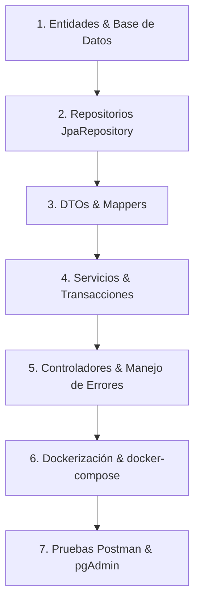

# Plan de Preparación para el Examen: Construcción de un Backend Spring Boot Completo

Este documento es tu **guía de supervivencia y plantilla definitiva** para el examen. Está diseñado para ayudarte a estructurar, construir de extremo a extremo, dockerizar y probar el backend de cualquier caso de estudio que te presenten, partiendo desde cero.

---

## 🗺️ Mapa de Ruta del Backend de Examen

Para que tu backend funcione al 100% y obtengas la máxima puntuación, seguiremos este orden lógico de construcción:



---

## 🛠️ Fase 1: Entidades y Relaciones (Persistencia)
Cuando te den el caso de estudio (ej. "Sistema de Matrícula", "Reserva de Vuelos"), lo primero es identificar los **Entidades (Tablas)** y sus **Relaciones**. 

### 💡 Código Plantilla: Entidad Principal (`@Entity`)
Crea tus entidades en el paquete `domain` o `model`. Usa **Lombok** para ahorrar tiempo en el examen.

```java
package com.hampcode.domain;

import jakarta.persistence.*;
import lombok.*;
import java.math.BigDecimal;
import java.time.LocalDate;

@Entity
@Table(name = "productos")
@Getter
@Setter
@NoArgsConstructor
@AllArgsConstructor
@Builder
public class Producto {

    @Id
    @GeneratedValue(strategy = GenerationType.IDENTITY)
    private Long id;

    @Column(nullable = false, unique = true, length = 100)
    private String nombre;

    @Column(nullable = false, precision = 10, scale = 2)
    private BigDecimal precio;

    private Integer stock;

    @Column(name = "fecha_creacion")
    private LocalDate fechaCreacion;

    // Relación Muchos a Uno (ej. Un Producto pertenece a una Categoría)
    @ManyToOne(fetch = FetchType.LAZY)
    @JoinColumn(name = "categoria_id", nullable = false)
    private Categoria categoria;
}
```

> [!IMPORTANT]
> **Relaciones Lazy (`FetchType.LAZY`):** Siempre usa `FetchType.LAZY` en relaciones `@ManyToOne` y `@OneToOne` para evitar consultas innecesarias a la base de datos (problema de N+1 queries).
> **BigDecimal:** Para campos monetarios (precios, balances, montos), **nunca** uses `float` o `double` debido a errores de redondeo de punto flotante. Usa `BigDecimal`.

---

## 📦 Fase 2: Repositorios (`@Repository`)
Las interfaces de repositorio heredan todos los métodos CRUD básicos. Si tu examen pide búsquedas específicas, usa métodos por convención de nombres o `@Query` con JPQL.

```java
package com.hampcode.repository;

import com.hampcode.domain.Producto;
import org.springframework.data.jpa.repository.JpaRepository;
import org.springframework.data.jpa.repository.Query;
import org.springframework.data.repository.query.Param;
import org.springframework.stereotype.Repository;
import java.math.BigDecimal;
import java.util.List;

@Repository
public interface ProductoRepository extends JpaRepository<Producto, Long> {

    // 1. Query Method automático (Spring infiere el SQL)
    List<Producto> findByNombreContainingIgnoreCase(String nombre);

    // 2. Query Personalizado usando JPQL (Orientado a objetos Java)
    @Query("SELECT p FROM Producto p WHERE p.precio BETWEEN :min AND :max ORDER BY p.precio ASC")
    List<Producto> buscarPorRangoDePrecio(@Param("min") BigDecimal min, @Param("max") BigDecimal max);
}
```

---

## ✉️ Fase 3: DTOs y Mapeo
Para evitar exponer directamente las entidades JPA a la API (lo cual es una mala práctica de arquitectura), usaremos **Records de Java** como DTOs (Data Transfer Objects). Son inmutables, limpios y rapidísimos de escribir.

### 📝 Request DTO (Para crear/actualizar)
```java
package com.hampcode.dto;

import jakarta.validation.constraints.*;
import java.math.BigDecimal;

public record ProductoRequest(
    @NotBlank(message = "El nombre no puede estar vacío")
    @Size(max = 100)
    String nombre,

    @NotNull(message = "El precio es obligatorio")
    @Positive(message = "El precio debe ser mayor a 0")
    BigDecimal precio,

    @Min(value = 0, message = "El stock no puede ser negativo")
    Integer stock,

    @NotNull(message = "La categoría es obligatoria")
    Long categoriaId
) {}
```

### ✉️ Response DTO (Para devolver al cliente)
```java
package com.hampcode.dto;

import java.math.BigDecimal;

public record ProductoResponse(
    Long id,
    String nombre,
    BigDecimal precio,
    Integer stock,
    String nombreCategoria
) {}
```

### 🔄 Mapeador Manual Rápido (Ideal para Examen)
*Tip para el examen:* Si configurar MapStruct te da problemas de compilación, crea un mapeador manual simple para no perder tiempo.

```java
package com.hampcode.mapper;

import com.hampcode.domain.Producto;
import com.hampcode.dto.ProductoResponse;

public class ProductoMapper {
    
    public static ProductoResponse toResponse(Producto entity) {
        if (entity == null) return null;
        return new ProductoResponse(
            entity.getId(),
            entity.getNombre(),
            entity.getPrecio(),
            entity.getStock(),
            entity.getCategoria() != null ? entity.getCategoria().getNombre() : null
        );
    }
}
```

---

## ⚙️ Fase 4: Servicios y Lógica de Negocio (`@Service`)
Aquí es donde aplicas las reglas del caso de estudio (ej. "no vender si no hay stock", "aplicar descuento si es domingo").

```java
package com.hampcode.service;

import com.hampcode.domain.Producto;
import com.hampcode.dto.ProductoRequest;
import com.hampcode.dto.ProductoResponse;
import com.hampcode.exception.ResourceNotFoundException;
import com.hampcode.mapper.ProductoMapper;
import com.hampcode.repository.CategoriaRepository;
import com.hampcode.repository.ProductoRepository;
import lombok.RequiredArgsConstructor;
import org.springframework.stereotype.Service;
import org.springframework.transaction.annotation.Transactional;

@Service
@RequiredArgsConstructor
public class ProductoService {

    private final ProductoRepository productoRepository;
    private final CategoriaRepository categoriaRepository;

    @Transactional(readOnly = true)
    public ProductoResponse buscarPorId(Long id) {
        return productoRepository.findById(id)
                .map(ProductoMapper::toResponse)
                .orElseThrow(() -> new ResourceNotFoundException("Producto no encontrado con ID: " + id));
    }

    @Transactional
    public ProductoResponse registrarProducto(ProductoRequest request) {
        var categoria = categoriaRepository.findById(request.categoriaId())
                .orElseThrow(() -> new ResourceNotFoundException("Categoría no encontrada con ID: " + request.categoriaId()));

        Producto producto = Producto.builder()
                .nombre(request.nombre())
                .precio(request.precio())
                .stock(request.stock())
                .categoria(categoria)
                .build();

        return ProductoMapper.toResponse(productoRepository.save(producto));
    }
}
```

> [!TIP]
> **Anotación `@Transactional`:** Usa `@Transactional(readOnly = true)` en métodos que solo leen datos (mejora el rendimiento de Hibernate) y `@Transactional` simple en métodos que inserten, actualicen o eliminen datos (para garantizar atomicidad).

---

## 🚦 Fase 5: Controladores y Manejo Global de Errores

### 🔌 Controlador REST (`@RestController`)
```java
package com.hampcode.controller;

import com.hampcode.dto.ProductoRequest;
import com.hampcode.dto.ProductoResponse;
import com.hampcode.service.ProductoService;
import jakarta.validation.Valid;
import lombok.RequiredArgsConstructor;
import org.springframework.http.HttpStatus;
import org.springframework.http.ResponseEntity;
import org.springframework.web.bind.annotation.*;

@RestController
@RequestMapping("/api/v1/productos")
@RequiredArgsConstructor
public class ProductoController {

    private final ProductoService productoService;

    @GetMapping("/{id}")
    public ResponseEntity<ProductoResponse> obtenerPorId(@PathVariable Long id) {
        return ResponseEntity.ok(productoService.buscarPorId(id));
    }

    @PostMapping
    public ResponseEntity<ProductoResponse> registrar(@Valid @RequestBody ProductoRequest request) {
        return new ResponseEntity<>(productoService.registrarProducto(request), HttpStatus.CREATED);
    }
}
```

### 🚨 Manejador de Excepciones Global (`@RestControllerAdvice`)
Tener esto implementado le dará un aspecto extremadamente profesional a tu backend. Evitará que la API devuelva una traza de error Java fea de 500 líneas al cliente y en su lugar retornará un JSON estructurado.

```java
package com.hampcode.exception;

import org.springframework.http.HttpStatus;
import org.springframework.http.ResponseEntity;
import org.springframework.web.bind.MethodArgumentNotValidException;
import org.springframework.web.bind.annotation.*;
import java.time.LocalDateTime;
import java.util.HashMap;
import java.util.Map;

@RestControllerAdvice
public class GlobalExceptionHandler {

    // 1. Manejo de recurso no encontrado (404)
    @ExceptionHandler(ResourceNotFoundException.class)
    public ResponseEntity<Map<String, Object>> handleNotFound(ResourceNotFoundException ex) {
        Map<String, Object> body = new HashMap<>();
        body.put("timestamp", LocalDateTime.now());
        body.put("status", HttpStatus.NOT_FOUND.value());
        body.put("error", "Not Found");
        body.put("message", ex.getMessage());
        return new ResponseEntity<>(body, HttpStatus.NOT_FOUND);
    }

    // 2. Manejo de errores de validación (@Valid) (400 Bad Request)
    @ExceptionHandler(MethodArgumentNotValidException.class)
    public ResponseEntity<Map<String, Object>> handleValidationErrors(MethodArgumentNotValidException ex) {
        Map<String, Object> body = new HashMap<>();
        body.put("timestamp", LocalDateTime.now());
        body.put("status", HttpStatus.BAD_REQUEST.value());
        body.put("error", "Validation Error");
        
        Map<String, String> errors = new HashMap<>();
        ex.getBindingResult().getFieldErrors().forEach(error -> 
            errors.put(error.getField(), error.getDefaultMessage())
        );
        body.put("errors", errors);
        
        return new ResponseEntity<>(body, HttpStatus.BAD_REQUEST);
    }
}
```

---

## 🐳 Fase 6: Dockerización y docker-compose

Para compilar, levantar tu base de datos PostgreSQL, ejecutar la aplicación y levantar **pgAdmin** en un solo comando, usaremos Docker Compose.

### 1. Crear el `Dockerfile` (En la raíz del proyecto)
Utilizaremos un **Dockerfile Multi-Stage** para construir el JAR de forma automática dentro del contenedor sin depender de que tu computadora tenga instalado Maven.

```dockerfile
# Stage 1: Compilar la aplicación
FROM maven:3.9-eclipse-temurin-21 AS build
WORKDIR /workspace
COPY pom.xml .
RUN mvn -B dependency:go-offline
COPY src ./src
RUN mvn -B clean package -DskipTests

# Stage 2: Imagen de ejecución liviana
FROM eclipse-temurin:21-jre-alpine
WORKDIR /app
COPY --from=build /workspace/target/*.jar app.jar
EXPOSE 8080
ENTRYPOINT ["java", "-jar", "app.jar"]
```

### 2. Crear el `compose.yml` (En la raíz del proyecto)
Este archivo levantará:
1. Tu base de datos PostgreSQL.
2. Tu backend Spring Boot (conectado a Postgres).
3. **pgAdmin 4** (conectado al mismo entorno).

```yaml
services:
  db:
    image: postgres:16-alpine
    container_name: mi_proyecto_db
    environment:
      POSTGRES_DB: mi_db
      POSTGRES_USER: postgres
      POSTGRES_PASSWORD: adminpassword
    ports:
      - "5432:5432"
    volumes:
      - postgres_data:/var/lib/postgresql/data
    healthcheck:
      test: ["CMD-SHELL", "pg_isready -U postgres -d mi_db"]
      interval: 5s
      timeout: 5s
      retries: 5

  api:
    build: .
    container_name: mi_proyecto_api
    environment:
      SPRING_PROFILES_ACTIVE: local
      SPRING_DATASOURCE_URL: jdbc:postgresql://db:5432/mi_db
      SPRING_DATASOURCE_USERNAME: postgres
      SPRING_DATASOURCE_PASSWORD: adminpassword
      SPRING_JPA_HIBERNATE_DDL_AUTO: update
    ports:
      - "8080:8080"
    depends_on:
      db:
        condition: service_healthy

  pgadmin:
    image: dpage/pgadmin4
    container_name: mi_proyecto_pgadmin
    environment:
      PGADMIN_DEFAULT_EMAIL: admin@examen.com
      PGADMIN_DEFAULT_PASSWORD: admin
    ports:
      - "8082:80"
    depends_on:
      - db

volumes:
  postgres_data:
```

### 🚀 Comandos mágicos para ejecutar:
Ejecuta esto en la terminal desde la carpeta del proyecto:
*   **Iniciar todo el entorno (Base de datos + API + pgAdmin):**
    ```powershell
    docker compose up --build
    ```
*   **Detener y eliminar contenedores:**
    ```powershell
    docker compose down
    ```
*   **Detener borrando la data acumulada en BD (para pruebas limpias):**
    ```powershell
    docker compose down -v
    ```

---

## 📊 Fase 7: Visualizar Datos en pgAdmin

Una vez que levantaste tu entorno con `docker compose up --build`, puedes acceder a la interfaz gráfica de tu base de datos:

1.  Abre tu navegador web e ingresa a: **`http://localhost:8082`**.
2.  Inicia sesión con las credenciales que definimos en el `compose.yml`:
    *   **Email:** `admin@examen.com`
    *   **Password:** `admin`
3.  **Registrar tu Base de Datos en pgAdmin:**
    *   Haz clic derecho en **Servers** -> **Register** -> **Server...**
    *   **Pestaña "General":** Ponle un nombre (ej. `ExamenBD`).
    *   **Pestaña "Connection":**
        *   **Host name/address:** `db` (¡Atención! Ponemos `db` porque dentro de la red de Docker, los contenedores se comunican usando los nombres definidos en el `compose.yml`). Si estuvieras conectándote desde tu IDE local fuera de Docker, pondrías `localhost`.
        *   **Port:** `5432`
        *   **Maintenance database:** `mi_db`
        *   **Username:** `postgres`
        *   **Password:** `adminpassword`
    *   Haz clic en **Save** ¡Y listo! Ya podrás ver tus tablas en `Schemas -> public -> Tables` y hacer consultas SQL.

---

## 📮 Fase 8: Pruebas del API con Postman

Abre Postman y crea una carpeta de colección para tu proyecto.

### 1. Petición POST para Registrar (Creación)
*   **Método:** `POST`
*   **URL:** `http://localhost:8080/api/v1/productos`
*   **Headers:**
    *   `Content-Type: application/json`
*   **Body (raw -> JSON):**
    ```json
    {
      "nombre": "Laptop Asus ROG",
      "precio": 1250.00,
      "stock": 15,
      "categoriaId": 1
    }
    ```
*   **Respuesta Esperada (201 Created):**
    ```json
    {
      "id": 1,
      "nombre": "Laptop Asus ROG",
      "precio": 1250.00,
      "stock": 15,
      "nombreCategoria": "Tecnología"
    }
    ```

### 2. Petición GET para Obtener por ID
*   **Método:** `GET`
*   **URL:** `http://localhost:8080/api/v1/productos/1`
*   **Respuesta Esperada (200 OK):**
    ```json
    {
      "id": 1,
      "nombre": "Laptop Asus ROG",
      "precio": 1250.00,
      "stock": 15,
      "nombreCategoria": "Tecnología"
    }
    ```

### 3. Petición de Error (Validación)
Prueba enviando un precio negativo para verificar si tu `@RestControllerAdvice` funciona adecuadamente:
*   **Método:** `POST`
*   **URL:** `http://localhost:8080/api/v1/productos`
*   **Body:**
    ```json
    {
      "nombre": "Laptop Asus ROG",
      "precio": -10.00,
      "stock": 15,
      "categoriaId": 1
    }
    ```
*   **Respuesta Esperada (400 Bad Request):**
    ```json
    {
      "timestamp": "2026-05-17T14:20:00",
      "status": 400,
      "error": "Validation Error",
      "errors": {
        "precio": "El precio debe ser mayor a 0"
      }
    }
    ```

---

## 🎯 Plan de Estudio Práctico de 3 Pasos

Para garantizar que domines esto antes del examen, realizaremos este entrenamiento práctico juntos:

1.  **Paso 1 (Simulación de Modelado y CRUD):** Definiremos un caso de estudio de examen sencillo (por ejemplo, "Sistema de Gestión de Citas Médicas" o "Reserva de Matrícula"). Crearemos las Entidades, Repositorios, Servicios, DTOs y Controladores juntos.
2.  **Paso 2 (Dockerización y Base de Datos):** Escribiremos y probaremos el archivo `Dockerfile` y `compose.yml` para levantar la base de datos y la aplicación localmente, y te guiaré para que la conectes a pgAdmin.
3.  **Paso 3 (Mockito Testing):** Escribiremos pruebas unitarias con Mockito para la capa de servicios para que tengas este plus dominado y asegures tu puntaje completo en validaciones y pruebas.
